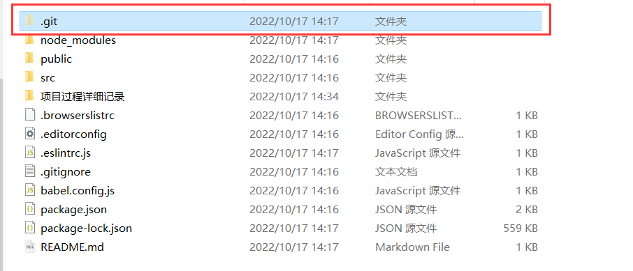

## 一、初始化项目

首先保证已经安装了vue-cli工具，这是vue命令行工具，用来创建项目。

```cmd
vue --version
```

 ### 创建项目

```cmd
vue create toutiao-m
```

创建过程中选择手动创建，vue3项目，需要vuex和router,路由模式选择hash模式（非history mode)

创建成功之后，运行项目

```shell
 $ cd toutiao-m
 $ npm run serve
```

### Git版本管理

先在github上创建一个仓库，如果项目下没有本地仓库

```
# 创建本地仓库
git init

# 将文件添加到暂存区
git add 文件

# 提交历史记录
git commit -m "提交日志"

# 添加远端仓库地址
git remote add origin 你的远程仓库地址

# 推送提交
git push -u origin master
```

如果已经有了本地仓库，那么直接添加远程仓库地址即可

```
# 添加远端仓库地址
git remote add origin 你的远程仓库地址

# 推送提交
git push -u origin master
```

可以看到，vue-cli在创建项目的时候，已经对本地仓库进行了初始化

